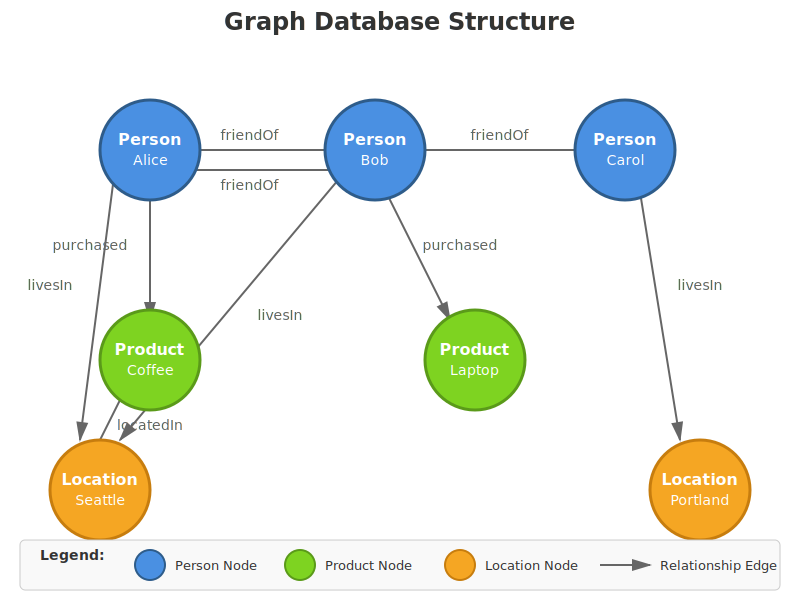

# Introduction to Graph Databases

## What is a Graph Database?

A graph database is a type of database that uses graph structures to store, map, and query relationships between data. Unlike traditional relational databases that store data in tables with rows and columns, graph databases represent data as nodes (entities) and edges (relationships). 

**Each node represents an entity—such as a person, product, or location—while edges represent the connections between them, like friendships, purchases, or geographic proximity.** These edges can have properties that describe the nature and strength of relationships, making graph databases particularly powerful for modeling complex, interconnected data.

Graph databases excel at answering questions about relationships and connections. They're designed for scenarios where understanding "how things are related" is as important as understanding the things themselves. For example, finding the shortest path between two people in a social network, identifying clusters of fraud in financial transactions, or recommending products based on similar users' purchasing patterns are all naturally expressed as graph queries. 
**The key advantage is performance.** while a relational database might require multiple expensive JOIN operations across many tables to traverse relationships, a graph database can follow connections directly, often orders of magnitude faster for relationship-heavy queries.

## Why Use a Graph Database?

The primary advantages of graph databases include:

- Intuitive data modeling
- Query simplicity
- Performance for connected data

When your domain naturally involves relationships—social networks, recommendation engines, knowledge graphs, network topology, supply chains, or fraud detection—modeling it as a graph feels natural and matches how you think about the problem. **Graph query languages provide visual, declarative syntax that makes complex relationship queries readable and maintainable, often reducing what would be dozens of lines of SQL with recursive CTEs into just a few lines of pattern-matching code.**

Performance is another critical advantage. Traditional relational databases struggle with queries that traverse multiple levels of relationships because each level requires additional JOINs, and query performance degrades exponentially as relationship depth increases. Graph databases maintain index-free adjacency, meaning each node directly references its neighbors, allowing them to traverse millions of connections per second regardless of the overall data size. This makes graph databases ideal for real-time queries over deeply connected data, such as finding influencers within six degrees of separation, detecting circular payment patterns, or analyzing supply chain dependencies.

## Industry Adoption and Use Cases

Major technology companies have adopted graph databases to power some of their most critical features. 

- **LinkedIn:** uses graph technology to power its professional network, including features like "People You May Know," calculating network size and connection strength, and identifying thought leaders and influencers within industries. Their graph contains hundreds of millions of professionals and billions of connections, and graph queries enable them to deliver personalized recommendations and insights in real-time.

- **Facebook (Meta):** built its own graph database infrastructure to manage its massive social graph of billions of users and trillions of connections. The company uses graph queries to power friend suggestions, newsfeed ranking, content recommendations, and ad targeting.

- **Google:** uses graph databases for its Knowledge Graph, which powers search result enhancements, question answering, and entity understanding across billions of web pages and entities. The Knowledge Graph helps Google understand that when you search for "Barack Obama," you're looking for information about the 44th President of the United States, and can surface related entities like Michelle Obama, Joe Biden, and the White House.

- **Financial institutions:** leverage graph databases for fraud detection and anti-money laundering (AML) compliance. Banks like JPMorgan Chase and Capital One use graph analytics to identify suspicious patterns such as circular payment loops, shell company networks, and coordinated account activities that might indicate money laundering or fraud rings. The ability to quickly traverse transaction chains and identify hidden relationships between accounts is crucial for meeting regulatory requirements while minimizing false positives.

- **E-commerce giants: like Amazon and eBay** use graph technology for product recommendations, analyzing not just what individual customers buy, but the purchasing patterns of similar customers and relationships between products to power their "customers who bought this also bought" features.

- **Telecommunications companies** use graph databases to manage and optimize their network infrastructure, tracking connections between cell towers, fiber optic cables, and network equipment to quickly identify points of failure and optimize routing. 

- **Healthcare organizations** employ graph databases to model patient care pathways, drug interactions, and disease progression patterns, enabling better treatment recommendations and identifying potential adverse reactions.

- **NASA** uses graph technology to model relationships between missions, spacecraft components, and scientific data, helping engineers understand complex system dependencies and potential failure cascades.

 **Source: <i>Anthropic. (2025, November 7). Introduction to Graph Databases.  Generated by Claude Sonnet 4.5.</i>**